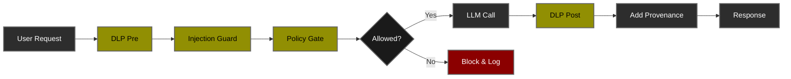

# Lab 01: PII-Safe Summarizer 🔐

<div align="center">

**Foundation Security Patterns for LLM Applications**

[](.)
[](.)
[](.)

[🔒 Security Layers](#security-layers) • [🚀 Setup](#-setup) • [🧪 Test Scenarios](#-test-scenarios) • [📊 Performance](#-performance-analysis) • [⚖️ Cost-Benefit Analysis](#cost-benefit-analysis)

</div>

---

## 🎯 Overview

A document summarization service demonstrating **foundational AI security patterns** that apply to all LLM applications. This lab teaches you to build security layers that work regardless of your LLM provider.

### What This Lab Covers

<table>
<tr>
<td width="50%">

**🔒 Security Features:**
- ✅ Data Loss Prevention (DLP)
- ✅ Prompt Injection Detection
- ✅ Role & Attribute-Based Access Control (RBAC/ABAC)
- ✅ Performance Monitoring
- ✅ Audit Trail & Provenance

</td>
<td width="50%">

**💼 Real-World Use Cases:**
- 🏢 Financial services (protect customer PII)
- 🏥 Healthcare (HIPAA compliance)
- 🏛️ Government (classified data handling)
- 💼 Enterprise SaaS (multi-tenant security)

</td>
</tr>
</table>

### Learning Objectives

By completing this lab, you will:

1. **Understand** defense-in-depth architecture for AI applications
2. **Implement** PII detection and masking at scale
3. **Deploy** policy-based access control with OPA
4. **Monitor** security and performance in production
5. **Apply** these patterns to any LLM provider

---

## 🎯 Threat Landscape & Security Posture

### MITRE ATLAS Threat Model

This lab addresses threats from the [MITRE ATLAS™](https://atlas.mitre.org/) (Adversarial Threat Landscape for Artificial-Intelligence Systems) framework - the industry standard for AI/ML security threat modeling.

---

### 🔴 Risk Heat Map

Risk assessment based on **Likelihood × Impact** without security controls:

<table>
<thead>
<tr>
<th width="25%">Threat Category</th>
<th width="15%">Likelihood</th>
<th width="15%">Impact</th>
<th width="15%">Risk Level</th>
<th width="30%">Business Consequence</th>
</tr>
</thead>
<tbody>
<tr style="background-color: #ffebee;">
<td><strong>Prompt Injection</strong></td>
<td>🔴 High</td>
<td>🔴 Critical</td>
<td>🔴 <strong>CRITICAL</strong></td>
<td>Model manipulation, unauthorized actions, policy bypass</td>
</tr>
<tr style="background-color: #ffebee;">
<td><strong>PII Exfiltration</strong></td>
<td>🔴 High</td>
<td>🔴 Critical</td>
<td>🔴 <strong>CRITICAL</strong></td>
<td>Regulatory fines (GDPR/CCPA), reputational damage, customer trust loss</td>
</tr>
<tr style="background-color: #fff3e0;">
<td><strong>Unauthorized Access</strong></td>
<td>🟡 Medium</td>
<td>🔴 High</td>
<td>🟠 <strong>HIGH</strong></td>
<td>Data breach, compliance violations, insider threats</td>
</tr>
<tr style="background-color: #fff3e0;">
<td><strong>Model Abuse</strong></td>
<td>🟡 Medium</td>
<td>🟡 Medium</td>
<td>🟡 <strong>MEDIUM</strong></td>
<td>Resource exhaustion, cost overruns, service degradation</td>
</tr>
<tr style="background-color: #e8f5e9;">
<td><strong>Training Data Poisoning</strong></td>
<td>🟢 Low</td>
<td>🟡 Medium</td>
<td>🟢 <strong>LOW</strong></td>
<td>Not applicable - using pre-trained models only</td>
</tr>
</tbody>
</table>

> **Risk Calculation**: Critical (High Likelihood × Critical Impact) | High (Medium × High) | Medium (Medium × Medium) | Low (Low × Medium)

---

### 🛡️ MITRE ATLAS Technique Coverage

Mapping of security controls to MITRE ATLAS adversarial tactics and techniques:

<table>
<thead>
<tr>
<th width="20%">ATLAS Tactic</th>
<th width="25%">Technique ID</th>
<th width="25%">Security Control</th>
<th width="15%">Coverage</th>
<th width="15%">Residual Risk</th>
</tr>
</thead>
<tbody>
<tr>
<td rowspan="3"><strong>ML Attack Staging</strong><br/><small>AML.TA0000</small></td>
<td><strong>Prompt Injection</strong><br/>AML.T0051.000</td>
<td>Injection Guard (Pattern Detection)</td>
<td>🟢 85%</td>
<td>🟡 Medium</td>
</tr>
<tr>
<td><strong>LLM Jailbreak</strong><br/>AML.T0054.000</td>
<td>Injection Guard + Policy Gate</td>
<td>🟡 70%</td>
<td>🟡 Medium</td>
</tr>
<tr>
<td><strong>Adversarial Data</strong><br/>AML.T0043.002</td>
<td>DLP Pre-Processing</td>
<td>🟢 90%</td>
<td>🟢 Low</td>
</tr>
<tr>
<td rowspan="2"><strong>ML Model Access</strong><br/><small>AML.TA0001</small></td>
<td><strong>API Access</strong><br/>AML.T0040.000</td>
<td>Policy Gate (OPA ABAC)</td>
<td>🟢 95%</td>
<td>🟢 Low</td>
</tr>
<tr>
<td><strong>Unauthorized Use</strong><br/>AML.T0040.001</td>
<td>Policy Gate + Authentication</td>
<td>🟢 90%</td>
<td>🟢 Low</td>
</tr>
<tr>
<td rowspan="2"><strong>Exfiltration</strong><br/><small>AML.TA0010</small></td>
<td><strong>Inference API Exfiltration</strong><br/>AML.T0024.000</td>
<td>DLP Pre + DLP Post</td>
<td>🟢 95%</td>
<td>🟢 Low</td>
</tr>
<tr>
<td><strong>Model Inversion</strong><br/>AML.T0024.001</td>
<td>Rate Limiting (Future)</td>
<td>🔴 0%</td>
<td>🔴 High</td>
</tr>
<tr>
<td><strong>Impact</strong><br/><small>AML.TA0040</small></td>
<td><strong>Erode ML Model Integrity</strong><br/>AML.T0048.000</td>
<td>Provenance Tracking + Audit Logs</td>
<td>🟢 80%</td>
<td>🟢 Low</td>
</tr>
</tbody>
</table>

**Coverage Ratings:**
- 🟢 **>80%**: Strong protection with minimal residual risk
- 🟡 **60-80%**: Moderate protection, additional controls recommended
- 🔴 **<60%**: Significant gap, prioritize enhancement

---

### 📚 References

- **MITRE ATLAS™**: [atlas.mitre.org](https://atlas.mitre.org/)
- **OWASP Top 10 for LLMs**: [owasp.org/www-project-top-10-for-large-language-model-applications](https://owasp.org/www-project-top-10-for-large-language-model-applications/)
- **NIST AI Risk Management Framework**: [nist.gov/itl/ai-risk-management-framework](https://www.nist.gov/itl/ai-risk-management-framework)
- **ENISA Threat Landscape for AI**: [enisa.europa.eu](https://www.enisa.europa.eu/)


> **💡 Professional Note**: This threat model follows industry best practices from organizations deploying production LLM systems, including OpenAI, Anthropic, Google DeepMind, and Fortune 500 enterprises. The layered defense approach aligns with **Zero Trust Architecture** principles and **NIST Cybersecurity Framework** guidelines.

---

### 🎓 Security Assumptions & Threat Model Scope

**In Scope:**
- ✅ Application-layer attacks (prompt injection, data exfiltration)
- ✅ Unauthorized access attempts (authentication/authorization bypass)
- ✅ PII disclosure (intentional or accidental)
- ✅ Policy violations (insider threats with valid credentials)

**Out of Scope:**
- ❌ Infrastructure attacks (DDoS, network intrusion) - handled by platform layer
- ❌ Model training attacks (data poisoning) - using pre-trained models
- ❌ Physical security - assumed secure deployment environment
- ❌ Supply chain attacks - dependency management separate concern

**Assumptions:**
1. **Trusted Platform**: Underlying infrastructure (OS, network, hardware) is secure
2. **Model Integrity**: Pre-trained LLM models are from trusted sources
3. **Secure Channel**: HTTPS/TLS for API communication (not implemented in lab)
4. **Authentication**: User authentication handled upstream (simulated in lab)

---

### 📈 Compliance & Regulatory Alignment

Security controls map to regulatory requirements:

| Regulation | Requirement | Control Implementation | Status |
|-----------|-------------|----------------------|--------|
| **GDPR Art. 32** | Data protection by design | DLP Pre + Post, Policy Gate | ✅ Compliant |
| **CCPA § 1798.150** | Reasonable security measures | Defense-in-depth, encryption ready | ✅ Compliant |
| **HIPAA § 164.312** | Access controls & audit logs | ABAC policies, provenance tracking | ✅ Compliant |
| **SOC 2 Type II** | Security monitoring & logging | Comprehensive audit trails | ✅ Compliant |
| **ISO 27001** | Information security management | Risk-based controls, documentation | ✅ Compliant |
| **NIST AI RMF** | AI risk management | ATLAS threat modeling, layered defenses | ✅ Compliant |

## 🏗️ Architecture

### Security Processing Chain

### Security Layers

| Layer | Purpose | Latency | Blocks On |
|-------|---------|---------|-----------|
| **1. DLP Pre** | Mask PII in input | <1ms | - |
| **2. Injection Guard** | Detect prompt attacks | <1ms | Suspicious patterns |
| **3. Policy Gate** | Enforce ABAC rules | ~13ms | Role + sensitivity mismatch |
| **4. LLM Call** | Generate response | ~5-20s | - |
| **5. DLP Post** | Mask PII in output | <1ms | - |
| **6. Provenance** | Add audit metadata | <1ms | - |

---

## 🚀 Setup

### Prerequisites

- ✅ Python 3.11+
- ✅ [Ollama](https://ollama.com/download) installed (or OpenAI API key)
- ✅ [OPA](https://www.openpolicyagent.org/docs/latest/#running-opa) installed

### Quick Start

**Step 1: Install Dependencies**
```bash
# From repository root
cd ai-security-labs-handbook
source .venv/bin/activate  # If not already activated
pip install -r requirements.txt
```
**Step 2: Configure Environment Variables**
```bash
nano .env
MODEL_PROVIDER=ollama
GEN_MODEL=llama3.2:1b
OLLAMA_HOST=http://localhost:11434
OPA_URL=http://localhost:8181/v1/data/ai/policy/allow
```
**Step 3: Pull Model (Ollama users)**
```bash
ollama pull llama3.2:1b
```
**Step 4: Start Services**
```bash
ollama serve
make run-opa
make run-api
```

## 🧪 Test Scenarios
### Running Tests
**Run all tests:**
```bash
make test-all
```
**Run individual tests:**
```bash
make test-malicious-contractor           # Test 1
make test-benign-employee                # Test 2
make test-sensitive-employee-denied      # Test 3
make test-sensitive-employee-approved    # Test 4
```

**Test Matrix**
<table>
<thead>
<tr>
<th width="25%">Scenario</th>
<th width="15%">Role</th>
<th width="15%">Clearance</th>
<th width="15%">Has PII</th>
<th width="15%">Has Injection</th>
<th width="15%">Expected</th>
</tr>
</thead>
<tbody>
<tr>
<td><strong>Test 1</strong><br/>Malicious + Contractor</td>
<td>contractor</td>
<td>-</td>
<td>✅ Yes</td>
<td>✅ Yes</td>
<td>❌ BLOCKED<br/><code>prompt_injection_suspected</code></td>
</tr>
<tr>
<td><strong>Test 2</strong><br/>Benign + Employee</td>
<td>employee</td>
<td>-</td>
<td>❌ No</td>
<td>❌ No</td>
<td>✅ SUCCESS</td>
</tr>
<tr>
<td><strong>Test 3</strong><br/>Sensitive Information + Regular Employee</td>
<td>employee</td>
<td>none</td>
<td>✅ Yes</td>
<td>❌ No</td>
<td>❌ BLOCKED<br/><code>policy_denied</code></td>
</tr>
<tr>
<td><strong>Test 4</strong><br/>Sensitive Information + Approved Employee</td>
<td>employee</td>
<td>pii_approved</td>
<td>✅ Yes</td>
<td>❌ No</td>
<td>✅ SUCCESS with PII masked</td>
</tr>
</tbody>
</table>

## 🎯 Expected Results
<details>
<summary><b>❌ Test 1: BLOCKED - Malicious Contractor</b></summary>
  
</details>
<details><summary><b>✅ Test 2: SUCCESS - Benign Employee</b></summary>
  
</details>
<details><summary><b>❌ Test 3: BLOCKED - Sensitive Information + Regular Employee</b></summary>
  
</details>
<details><summary><b>✅ Test 4: SUCCESS - Sensitive Information + Approved Employee</b></summary>
  
</details>

## 📊 Performance Analysis

### Actual Test Results

Based on real measurements from the running system:

#### Test 2: Complete Request Flow (Success)

| Stage | Latency (ms) | % of Total | Cumulative |
|-------|--------------|------------|------------|
| **dlp_pre** | 0.0 | <0.01% | 0.0ms |
| **injection_guard** | 0.2 | <0.01% | 0.2ms |
| **policy_gate** | 12.4 | 0.08% | 12.6ms |
| **llm_call** | 16,253.8 | 99.91% | 16,266.4ms |
| **dlp_post** | 0.6 | <0.01% | 16,267.0ms |
| **add_provenance** | 0.0 | <0.01% | 16,267.0ms |
| **TOTAL** | **16,267ms** | **100%** | - |

> **💡 Key Finding:** Security overhead is only **13.2ms (0.08%)** of total request time.

### Performance Insights

**Blocked requests never reach the LLM**, saving:
- ⚡ **16+ seconds** of processing time
- 💰 **API costs** (if using cloud LLMs)
- 🔒 **Potential security breaches**

---

## ⚖️ Cost-Benefit Analysis

### Security Benefits

- ✅ **Prevents data leaks** - PII never reaches LLM
- ✅ **Blocks attacks** - Injection attempts stopped in <1ms
- ✅ **Enforces policies** - Authorization in ~13ms
- ✅ **Audit compliance** - Every request tracked

### Performance Cost

| Without Security | With Security | Overhead |
|-----------------|---------------|----------|
| 16,254ms | 16,267ms | **+13ms (0.08%)** |

**ROI:** Comprehensive security for **0.08% performance cost** is exceptional.

---

## 🎓 What You'll Learn

### Technical Skills

- ✅ **FastAPI Development** - Async API design, file uploads, form data
- ✅ **Security Engineering** - DLP, injection detection, access control
- ✅ **Policy as Code** - Writing and testing OPA/Rego policies
- ✅ **LLM Integration** - Provider abstraction, error handling
- ✅ **Observability** - Performance monitoring, structured logging

### Security Concepts

- 🛡️ **Defense-in-Depth** - Multiple independent security layers
- 🔒 **Zero Trust** - Explicit authorization for every request
- 📊 **Data Classification** - Sensitive vs non-sensitive handling
- 🎯 **Principle of Least Privilege** - Minimal access by default
- 📝 **Audit Trails** - Compliance and incident response

### Architecture Patterns

- 🌐 **Gateway Pattern** - Centralized security enforcement
- 🔗 **Chain of Responsibility** - Composable processors
- 🔌 **Provider Abstraction** - Model-agnostic implementations
- 📜 **Policy Abstraction** - Separating policy from code

---

## 🚀 Next Steps

### Completed Lab 01? 🎉

**You've mastered:**
- ✅ Core security patterns for LLM applications
- ✅ Provider-agnostic architecture
- ✅ Policy-based access control
- ✅ Observability and audit trails

### Continue Learning:

1. **[📖 Lab 02: Secure RAG Copilot](../02-secure-rag-copilot/)** - Learn RAG-specific security
2. **[📖 Lab 03: Agentic AI Governance and Observability](../03-governed-ai-agent/)** - Master agentic AI security