# Lab 02: Secure RAG Copilot 🔍

<div align="center">

**RAG-Specific Security Patterns for AI Applications**

[](.)
[](.)
[](.)

[🎯 Overview](#-overview) • [🏗️ Architecture](#architecture) • [🚀 Setup](#-setup) • [🧪 Tests](#-test-scenarios) • [📊 Results](RESULTS.md)

</div>

---

## 🎯 Overview

A Retrieval-Augmented Generation (RAG) copilot demonstrating defense against **indirect prompt injection**, **content poisoning**, and **information leakage** through document retrieval.

### Key Features

| Security | RAG-Specific |
|----------|--------------|
| ✅ Indirect Prompt Injection Defense | ✅ Vector Search Security |
| ✅ Content Validation (Pre-Ingestion) | ✅ Source Attribution |
| ✅ Context Sanitization | ✅ Test/Production Separation |
| ✅ DLP + Policy Gate + Provenance | ✅ Semantic Relevance Monitoring |

### Learning Objectives

1. **Understand** RAG-specific attack vectors (indirect injection via retrieved docs)
2. **Implement** content validation before document ingestion (Layer 1)
3. **Deploy** injection detection at query time (Layer 2 - defense-in-depth)
4. **Monitor** vector search security and citation tracking
5. **Differentiate** test vs production security postures

---

## 🎯 RAG-Specific Threats

| Threat | Attack Vector | Impact | Mitigation |
|--------|---------------|--------|------------|
| **Indirect Prompt Injection** | Malicious instructions in retrieved docs | 🔴 Critical | Content validation + context scanning |
| **Content Poisoning** | Docs with malicious instructions + relevant keywords | 🟠 High | Source trust levels + validation |
| **Information Leakage** | Over-retrieval of sensitive documents | 🟠 High | k-limit + metadata filtering |

**What Makes RAG Different?** Traditional LLM apps check user input only. RAG must also validate **retrieved content** that gets injected into the LLM context.

---

## 🏗️ Architecture

### RAG Security Processing Chain

```mermaid
graph LR
    A[User Query] --> B[Vector Search]
    B --> C[Top K Docs]
    C --> D[DLP Pre]
    D --> E[Injection Guard<br/>Raw Context]
    E --> F{Blocked?}
    F -->|Yes| G[Return Error]
    F -->|No| H[Policy Gate]
    H --> I{Allowed?}
    I -->|No| G
    I -->|Yes| J[Sanitize HTML]
    J --> K[LLM + Context]
    K --> L[DLP Post]
    L --> M[Add Provenance]
    M --> N[Response]
    
    style A fill:#2d2d2d,stroke:#666,stroke-width:2px,color:#fff
    style B fill:#4a90e2,stroke:#666,stroke-width:2px,color:#fff
    style C fill:#4a90e2,stroke:#666,stroke-width:2px,color:#fff
    style D fill:#918f03,stroke:#666,stroke-width:2px,color:#000
    style E fill:#918f03,stroke:#666,stroke-width:2px,color:#000
    style F fill:#1a1a1a,stroke:#666,stroke-width:2px,color:#fff
    style G fill:#8b0000,stroke:#666,stroke-width:2px,color:#fff
    style H fill:#918f03,stroke:#666,stroke-width:2px,color:#000
    style I fill:#1a1a1a,stroke:#666,stroke-width:2px,color:#fff
    style J fill:#918f03,stroke:#666,stroke-width:2px,color:#000
    style K fill:#2d2d2d,stroke:#666,stroke-width:2px,color:#fff
    style L fill:#918f03,stroke:#666,stroke-width:2px,color:#000
    style M fill:#2d2d2d,stroke:#666,stroke-width:2px,color:#fff
    style N fill:#2d2d2d,stroke:#666,stroke-width:2px,color:#fff
```


### Defense-in-Depth Layers

| Layer | When | Purpose | Blocks On |
|-------|------|---------|-----------|
| **0. Content Validation** | Ingestion | Reject malicious docs before embedding | 2+ suspicious patterns |
| **1. Vector Search** | Query | Find relevant docs, limit exposure | k=3 (top 3 only) |
| **2. DLP Pre** | Query | Mask PII in question | PII detection |
| **3. Injection Guard** | Query | Scan question + **raw context** | 1+ patterns in context |
| **4. Policy Gate** | Query | Enforce RBAC/ABAC | Role + clearance mismatch |
| **5. Sanitization** | Pre-LLM | Remove HTML/scripts | - |
| **6. LLM Call** | Processing | Generate grounded answer | - |
| **7. DLP Post** | Response | Mask PII in answer | PII detection |
| **8. Provenance** | Response | Add source citations | - |

**Key Insight:** Security checks run on **raw retrieved content** before sanitization. This ensures malicious patterns are detected even if they're in HTML tags.

---

## 🚀 Setup

### Prerequisites

- ✅ Completed [Lab 01](../pii-safe-summarizer/)
- ✅ Python 3.11+ with virtual environment
- ✅ Ollama with `llama3.2:1b` and `nomic-embed-text` models
- ✅ OPA running on port 8181

### Quick Start
```bash
cd ~/ai-security-labs-handbook
source .venv/bin/activate

# Install dependencies (includes chromadb)
pip install -r requirements.txt

# Pull embedding model
ollama pull nomic-embed-text

# Verify .env
grep EMB_MODEL .env
# Should show: EMB_MODEL=nomic-embed-text

# Start services
# Terminal 1: ollama serve
# Terminal 2: make run-opa
# Terminal 3: make run-rag
```

**Expected startup:**
```
[Lab02] Ingested 3 trusted docs from labs/rag_copilot/data/corpus
[Lab02] Production mode: Red team docs excluded
INFO:     Application startup complete.
```

---

## 🧪 Test Scenarios

### Production Mode (3 Benign Docs)

**Start:** `make run-rag`

#### Test 1: Security Features Query
```bash
make test-rag-benign-01
```

**Expected:** ✅ SUCCESS with DLP, OPA, injection screening answer

#### Test 2: Governance Query
```bash
make test-rag-benign-02
```

**Expected:** ✅ SUCCESS with governance guidance answer

---

### Test Mode (Defense-in-Depth Validation)

**Start:** `make run-rag-test` (includes 1 malicious doc)

**Why Test Mode?** Simulates scenarios where content validation is bypassed (insider threat, legacy data, disabled validation). Demonstrates Layer 2 (injection guard) catches attacks that Layer 1 misses.

#### Test 3: Indirect Prompt Injection
```bash
make test-rag-indirect-injection
```

**Expected:** ❌ BLOCKED by injection guard
```json
{
  "blocked": true,
  "reason": "prompt_injection_suspected",
  "meta": {
    "stages": [
      {"name": "dlp_pre", "latency_ms": 0.0},
      {"name": "injection_guard", "latency_ms": 0.4}
    ]
  }
}
```

**What Happened:**
1. Vector search retrieved evil doc (semantically relevant to "guidance")
2. Injection guard scanned **raw context** and found malicious patterns
3. Request blocked before reaching LLM (saved ~10 seconds + API costs)

---

### Test Matrix

| Test | Mode | Corpus | Query | Blocks At | Result |
|------|------|--------|-------|-----------|--------|
| **1** | Prod | 3 benign | "What are security features?" | - | ✅ SUCCESS |
| **2** | Prod | 3 benign | "What are governance practices?" | - | ✅ SUCCESS |
| **3** | Test | 3 benign + 1 evil | "Summarize all guidance" | Injection Guard | ❌ BLOCKED |

---

## 🔒 Security Features

### 1. Content Validation (Layer 0 - Ingestion Time)

**Prevents** malicious docs from entering the vector database.
```python
# In store_chroma.py
def validate_document(text: str, source_path: str):
    # Count suspicious patterns
    suspicious_count = sum(1 for p in PATTERNS if re.search(p, text, re.I))
    
    # Allow redteam docs (for testing only)
    if "redteam" in source_path:
        return True, "redteam_document"
    
    # Block if 2+ malicious patterns
    if suspicious_count >= 2:
        return False, f"rejected_suspicious_content"
    
    return True, "accepted"
```

**Result:** Malicious docs rejected before embedding.

---

### 2. Injection Guard (Layer 3 - Query Time)

**Detects** attacks in retrieved context (defense-in-depth).
```python
# In injection.py - context checking
if context:
    suspicious_count = sum(1 for p in BAD_HINTS if re.search(p, context, re.I))
    
    # Block if ANY pattern in retrieved context
    if suspicious_count >= 1:
        return {"blocked": True, "reason": "prompt_injection_suspected"}
```

**Why Strict?** Indirect injection is high-risk. Retrieved content directly influences LLM output.

---

### 3. Sanitization (After Security Approval)

**Critical Order:** Security checks → Sanitization → LLM
```python
# In main.py
# 1. Retrieve (raw content)
hits = query(body.question, k=3)
req = {"context": "\n\n".join([h["text"] for h in hits])}  # Raw

# 2. Security checks (on raw content)
req = injection_guard(req)
if req.get("blocked"): return req

# 3. Sanitize (only after approval)
for h in hits:
    h["text"] = sanitize(h["text"])  # Remove HTML/scripts

# 4. LLM call (with sanitized content)
```

**Why?** If sanitization runs first, it might remove malicious patterns before security can detect them.

---

## 📊 Performance

Typical request flow (production mode, successful query):

| Stage | Latency | % of Total | Notes |
|-------|---------|-----------|-------|
| Vector Search | ~80ms | 0.5% | ChromaDB query |
| Security Layers | ~13ms | 0.08% | DLP + Guard + Policy |
| LLM Call | ~3-5s | 99.4% | Ollama generation |
| **Total** | **~10-15s** | **100%** | |

**Key Findings:**
- 🚀 RAG security overhead: <100ms (<1%)
- ⚡ Blocked requests: <15ms (never reach LLM)
- 💰 Cost savings: ~15 seconds + API costs per blocked attack

> **📊 See [RESULTS.md](RESULTS.md) for detailed measurements.**

---

## 🎓 Key Learnings

### RAG-Specific Patterns

- **Indirect Injection**: Attacks hide in retrieved docs, not user input
- **Content Poisoning**: Malicious docs with relevant keywords rank high in searches
- **Defense-in-Depth**: Multiple validation layers (ingestion + query time)
- **Processing Order**: Check raw content before sanitization

### Best Practices

- ✅ Validate documents **before** embedding (prevent poisoning)
- ✅ Check retrieved content **before** LLM call (catch bypasses)
- ✅ Sanitize **after** security approval (preserve detection)
- ✅ Separate test/prod environments (safe security testing)
- ✅ Track source attribution (audit trail + verification)

---

## 🔧 Configuration
```bash
# .env file
MODEL_PROVIDER=ollama
GEN_MODEL=llama3.2:1b
EMB_MODEL=nomic-embed-text          # New for Lab 02
OLLAMA_HOST=http://localhost:11434
OLLAMA_URL=http://localhost:11434   # For embeddings
OPA_URL=http://localhost:8181/v1/data/ai/policy/allow
RAG_COLLECTION=lab02_docs           # ChromaDB collection
CHROMA_DB_PATH=./chroma_data        # Persistent storage
RAG_TEST_MODE=false                 # Set to 'true' for testing
```

---

## 🐛 Troubleshooting

<details>
<summary><b>Issue: Legitimate queries blocked in test mode</b></summary>

**Cause:** Malicious doc ranks high for queries, triggering injection guard.

**Solution:** Use production mode for normal operations:
```bash
make run-rag  # Production mode (no evil docs)
```

Test mode is only for validating defense-in-depth.
</details>

<details>
<summary><b>Issue: "0 red team docs ingested" in test mode</b></summary>

**Cause:** Evil doc in wrong location or `lifespan` not executing.

**Solution:**
```bash
# Verify file location
ls labs/rag_copilot/redteam/ipi_pages/evil.md

# Check main.py uses lifespan (not deprecated on_event)
grep "lifespan" labs/rag_copilot/app/main.py
```
</details>

---

## 📚 References

- **OWASP LLM01**: [Prompt Injection](https://owasp.org/www-project-top-10-for-large-language-model-applications/)
- **Simon Willison**: [Dual LLM Pattern for RAG](https://simonwillison.net/2023/Apr/25/dual-llm-pattern/)
- **ChromaDB Docs**: [docs.trychroma.com](https://docs.trychroma.com/)

---

## 🚀 Next Steps

### Completed Lab 02? 🎉

**You've mastered:**
- ✅ RAG-specific security patterns
- ✅ Content validation + defense-in-depth
- ✅ Indirect prompt injection defense
- ✅ Vector search security

**Validate:** 📊 **[View Test Results →](RESULTS.md)**

**Continue:** 
1. **[Lab 03: Governed Agentic AI](../governed-agentic-ai/)** - Agentic AI security (Coming Soon)
2. **[Lab 01: PII Summarizer](../pii-safe-summarizer/)** - Review foundations

---

<div align="center">

**[⬅️ Lab 01](../pii-safe-summarizer/)** • **[📊 Test Results](RESULTS.md)** • **[⬆️ Handbook](../../README.md)**

---

**Made with 🛡️ for the AI Security Community**

</div>